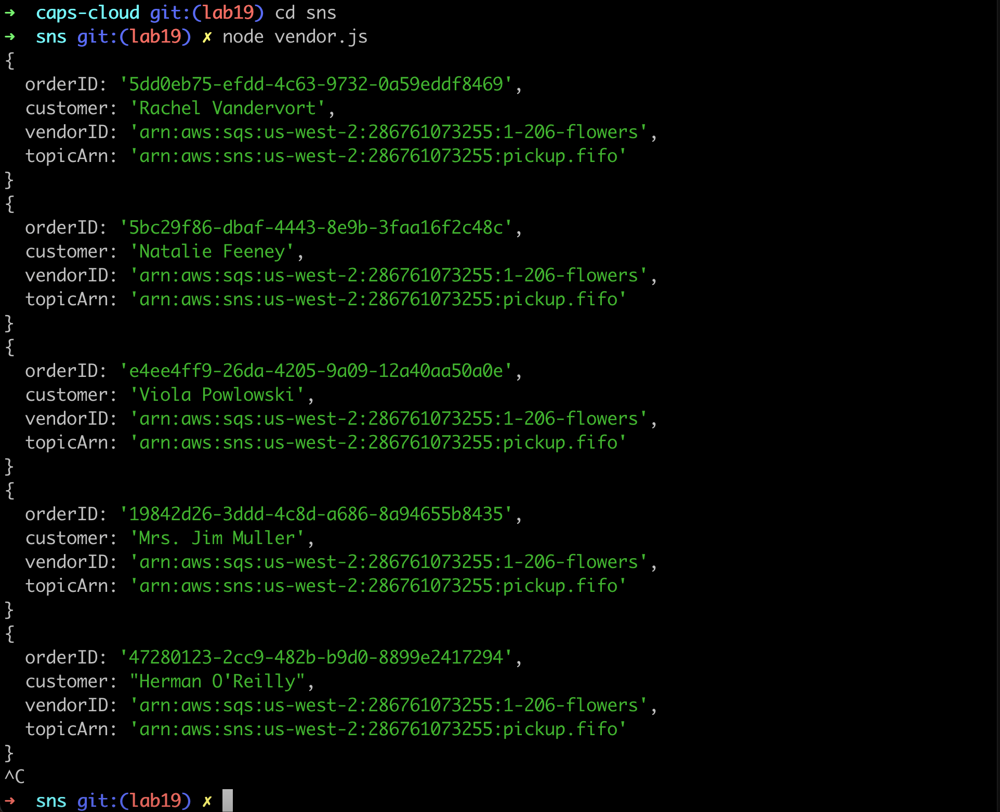
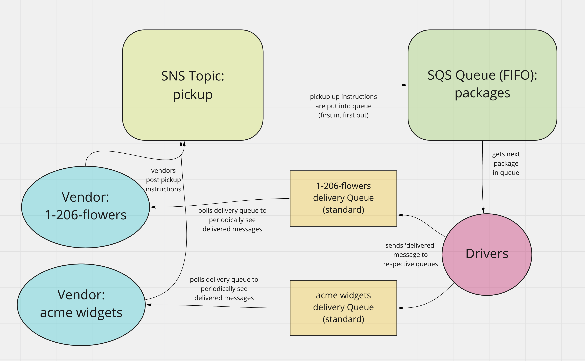

# caps-cloud

Author: Jessi Velazquez

PR: [https://github.com/JessiVelazquez/caps-cloud/pull/1](https://github.com/JessiVelazquez/caps-cloud/pull/1)

Deployed Link: N/A

Collaboration: Jason Taisley, Simone Odegard, Nicki Baldwin

# Overview and Description

In this system, we have two vendors (1-206-flowers and acme-widgets), who are both ordering drivers to pick up and deliver flowers. We create an AWS SNS topic 'pickup', where vendors post pickup instructions to. We then set up an AWS SQS Queue (FIFO) called 'packages', where the SNS messages from the 'pickup' topic are stored in a first in, first out queue format. Delivery drivers poll this FIFO queue to get the delivery order at the front of the queue. After the driver delivers the package, they send out a 'delivered' message to AWS standard queues set up for the individual vendors. Finally, each vendor periodically polls their respective SQS standard queues to see the delivery messages from the drivers.

The image below shows the console logging the original pickup order instructions from the vendors:

# UML

